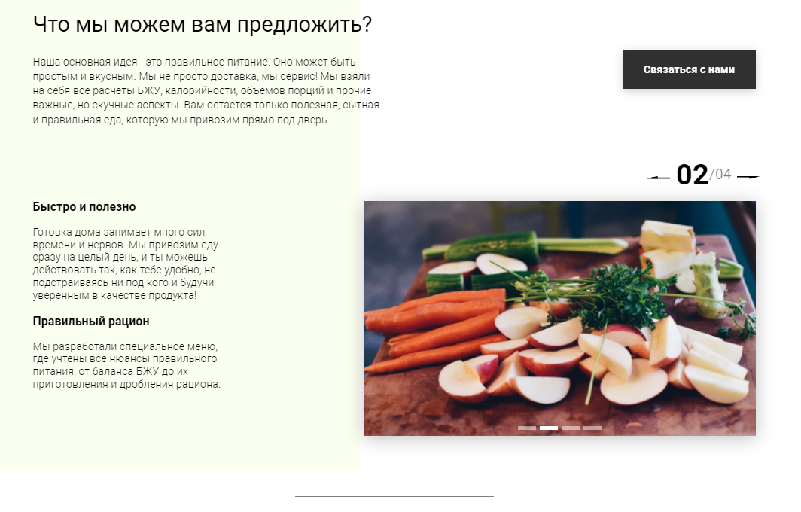

# Portfolio---Food    

:white_check_mark: Реализация табов на странице      
:white_check_mark: Создание модального окна, реализация скрипта отправки данных на сервер, оповещение пользователя     
:white_check_mark: Слайдер на странице и навигация для него (vanilla JS)    
:white_check_mark: Создание калькулятора на странице: расчет потребности в калориях (работа с localStorage)    
:white_check_mark: Создание карточек товара на странице с использование классов (получение данных с сервера async, await)    
:white_check_mark: Таймер обратного отсчета  

# Стек:      
- HTML        
- CSS        
- JS        
- Webpack      

# Screenshot:      
        
      
")      
      
      
     

